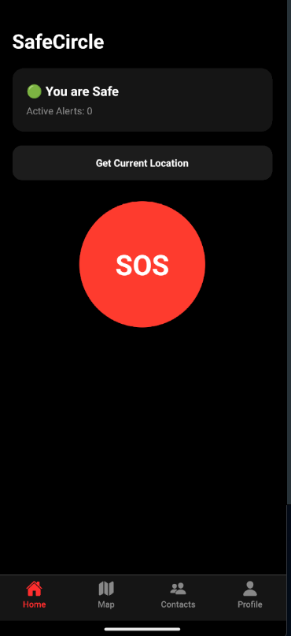
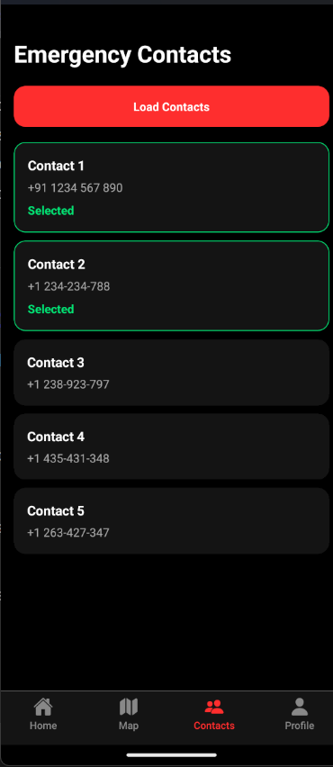
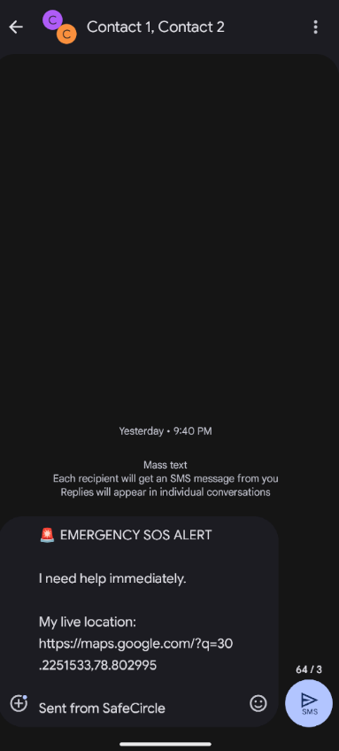
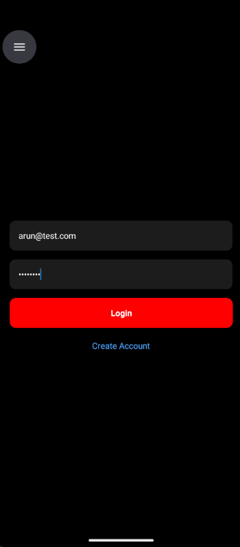
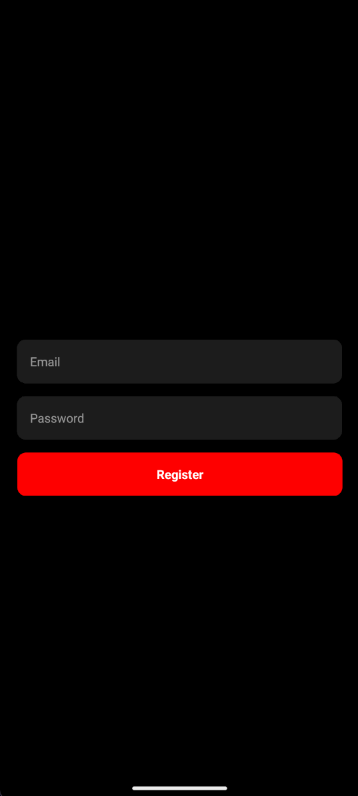

# 🚨 SafeCircle

SafeCircle is a React Native emergency response application that helps users quickly notify nearby people during emergencies through real-time SOS alerts, live location sharing, route navigation, and emergency contact notifications.

## ✨ Features

- 🚨 One-Tap SOS Activation
- 📍 Live Location Tracking
- 🗺️ Interactive Live Map
- 🔔 Nearby User Notifications
- 📡 Real-Time SOS Updates
- 🧭 Route Navigation to Victims
- 📱 Emergency Contact Management
- 📏 Distance-Based Alert Filtering
- 🔐 User Authentication
- ☁️ Supabase Backend Integration

---

## 🛠 Tech Stack

### Frontend
- React Native
- Expo
- React Navigation
- React Native WebView

### Backend
- Supabase
- PostgreSQL
- Supabase Realtime

### Maps & Navigation
- Leaflet.js
- OpenStreetMap
- Leaflet Routing Machine

### Notifications
- Expo Notifications
- Expo Push Notifications

### Communication
- Expo SMS
- Expo Contacts

---

## 📱 Screens

### Authentication
- Login Screen
- Registration Screen

### Main Features
- Home Screen
- Live Map Screen
- Emergency Contacts Screen
- Profile Screen

---

## 🏗 Project Structure

```text
SafeCircle/
│
├── assets/
├── components/
├── context/
├── screens/
├── services/
├── utils/
├── App.js
├── index.js
├── MainTabs.js
├── package.json
└── README.md
```

---

## 🗄 Database Schema

### users

| Field | Type |
|---------|---------|
| id | UUID |
| email | TEXT |
| latitude | FLOAT |
| longitude | FLOAT |
| expo_token | TEXT |
| created_at | TIMESTAMP |

### sos_alerts

| Field | Type |
|---------|---------|
| id | UUID |
| user_id | UUID |
| latitude | FLOAT |
| longitude | FLOAT |
| sender | TEXT |
| type | TEXT |
| created_at | TIMESTAMP |

---

## ⚙️ Installation

### 1. Clone Repository

```bash
git clone https://github.com/4run-Rangad/SafeCircle-App.git
cd SafeCircle-App
```

### 2. Install Dependencies

```bash
npm install
```

### 3. Configure Supabase

Create a file:

```text
services/supabase.js
```

Add your Supabase credentials:

```javascript
import { createClient } from "@supabase/supabase-js";

export const supabase = createClient(
  "YOUR_SUPABASE_URL",
  "YOUR_SUPABASE_ANON_KEY"
);
```

### 4. Start Development Server

```bash
npx expo start
```

---

## 🔒 Security

- Supabase Authentication
- Row Level Security (RLS)
- Protected User Data
- Distance-Based SOS Filtering

---

## 🚀 Future Enhancements

- Shake Detection SOS
- Voice Triggered SOS
- Background Location Tracking
- Police & Hospital Integration
- AI-Based Risk Detection
- Offline Emergency SMS

---

## 📸 Demo

Project Screenshots:

```md






```

---

## 👨‍💻 Author

**Arun Rangad**

MCA Final Year Project

---

## 📄 License

This project is developed for educational and academic purposes.